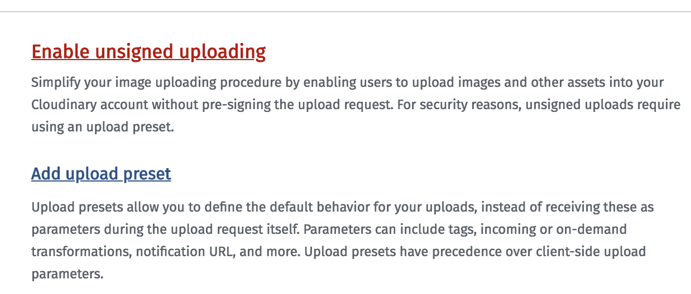
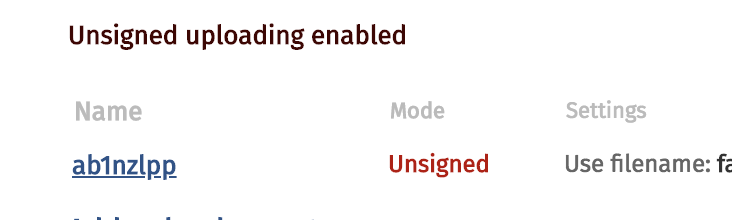

# Direct upload with Cloudinary

## Cloudinary account configuration

### Account

Go to [cloudinary.com](https://cloudinary.com) and subscribe.

### Configuration

Go to [Cloudinary upload settings](https://cloudinary.com/console/settings/upload)
and enable unsigned preset

Copy the preset id (you will paste it in your react component).

## Front end configuration

To use cloudinary direct ulpload (unsigned upload), you need :

* upload url : `https://api.cloudinary.com/v1_1/${cloudName}/image/upload`

* cloudName : Go to [Cloudinary account settings](https://cloudinary.com/console/settings/account) and pick up the "Cloudinary cloud name" value.

* upload_preset : Go to [Cloudinary upload settings](https://cloudinary.com/console/settings/upload) and pick up the preset name value (see the picture above).

You just need to set the right informations about "cloudName" and "preset" to run the demo.

## Run the demo

`npm install`

`npm start`

## Cloudinary documentation about direct upload

[uploading_with_a_direct_call_to_the_api](https://cloudinary.com/documentation/upload_images#uploading_with_a_direct_call_to_the_api)